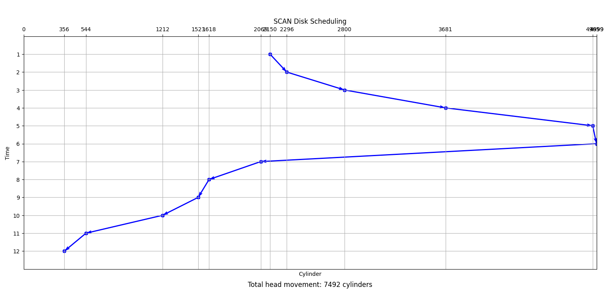
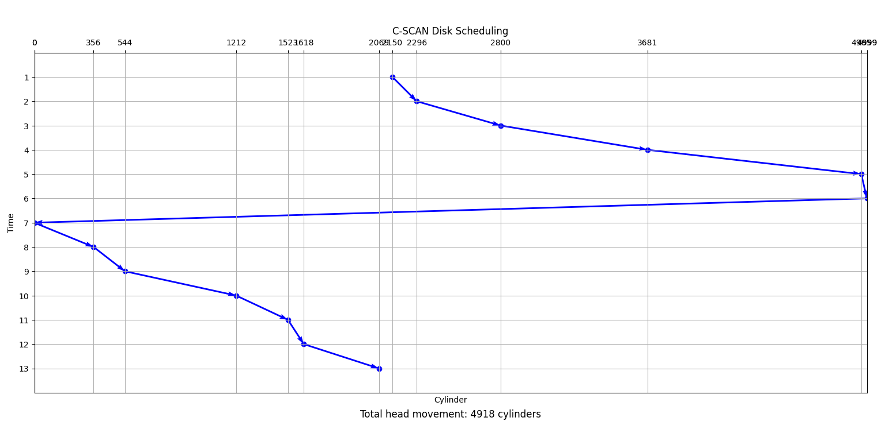
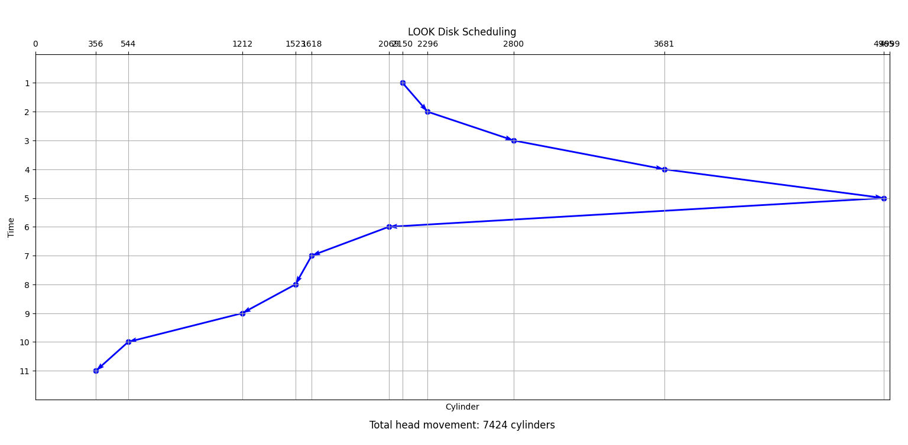
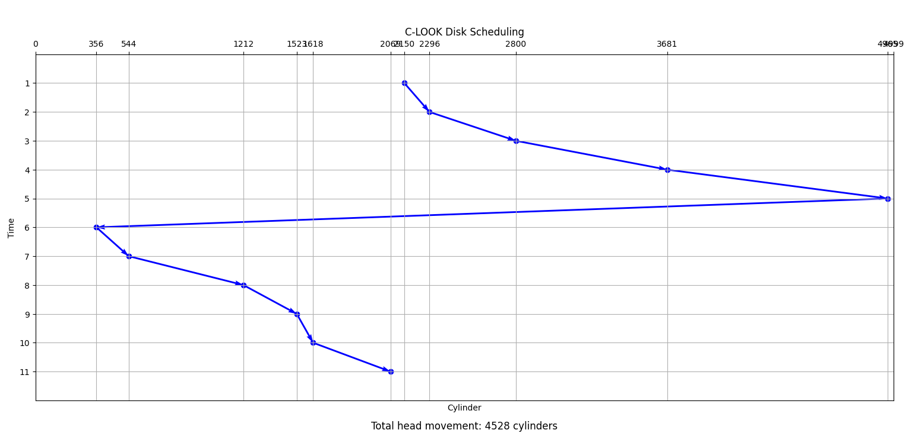

# Bài tập về nhà tuần 11

## Bài 1

Sử dụng các bản cài đặt của em cho các thuật toán [SCAN](./DiskScheduling/scan.py), [C-SCAN](./DiskScheduling/cscan.py), [LOOK](./DiskScheduling/look.py), [C-LOOK](./DiskScheduling/clook.py), em có kết quả chạy từng thuật toán với đầu vào đã cho như sau:

## Bài 2

Lượng dữ liệu được truyền trong một phút khi truy cập vào cùng một track trên ổ cứng $=$ số vòng quay trên 1 phút $\times$ số lượng sector trên một track $\times$ dung lượng mỗi sector $= 800 \times 10 \times 4\ \text{KB} = 32,000\ \text{KB}$.  
Do đó, tốc độ truyền dữ liệu khi truy cập vào cùng một track trên ổ cứng $= 32,000\ \text{KB/phút} \approx 533.3 \text{ KB/s hay } 4266.6 \text{Kb/s}$.
