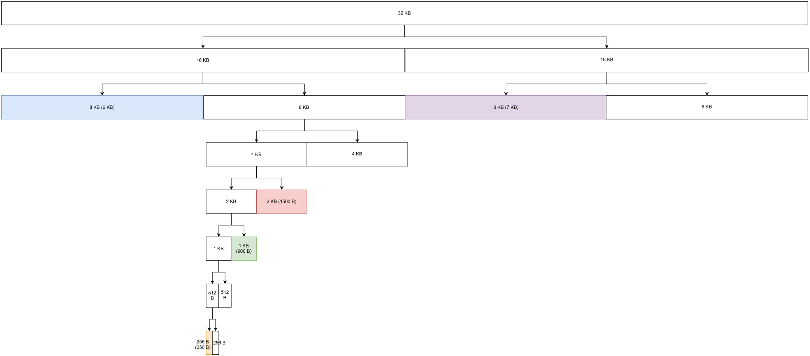
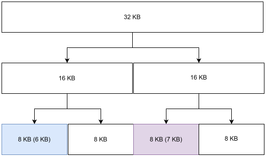

# Bài tập về nhà tuần 9

## Bài tập trong sách

### Bài 9.3

Các địa chỉ được tính trong hệ 16. Em giả sử rằng các địa chỉ ảo được truy cập dần bởi chương trình theo thứ tự thời gian, và khi gặp page-fault, hệ điều hành chọn free frame đầu tiên trong danh sách các free frame để load page vào.

| Virtual address | Page number = Virtual address $\div$ Page size | Offset = Virtual address $\div$ Page size | Free frame list | Page Frame                                                                                   | Physical address = Page Frame $\times$ Page size + Offset |
| --------------- | ---------------------------------------------- | ----------------------------------------- | --------------- | -------------------------------------------------------------------------------------------- | --------------------------------------------------------- |
| 9EF             | 9                                              | EF                                        | D, E, F         | 0                                                                                            | EF                                                        |
| 111             | 1                                              | 11                                        | D, E, F         | 2                                                                                            | 211                                                       |
| 700             | 7                                              | 0                                         | D, E, F         | D (page-fault occurs, the page is then loaded into the first free frame in the list, i.e. D) | D00                                                       |
| 0FF             | 0                                              | FF                                        | E, F            | E (page-fault occurs, the page is then loaded into the first free frame in the list, i.e. E) | EFF                                                       |

### Bài 9.8

Sử dụng cài đặt các thuật toán [LRU](./PageReplacementAlgorithms/LeastRecentlyUsed.java), [FIFO](./PageReplacementAlgorithms/FIFO.java), [Optimal replacement](./PageReplacementAlgorithms/Optimal.java), em có bảng kết quả thể hiện số page fault cho từng trường hợp thuật toán và số frame:

| Number of Pages     | 1   | 2   | 3   | 4   | 5   | 6   | 7   |
| ------------------- | --- | --- | --- | --- | --- | --- | --- |
| LRU replacement     | 20  | 18  | 15  | 10  | 8   | 7   | 7   |
| FIFO replacement    | 20  | 18  | 16  | 14  | 10  | 10  | 7   |
| Optimal replacement | 20  | 15  | 11  | 8   | 7   | 7   | 7   |

### Bài 9.19

Gọi page-fault rate $= p$. Khi đó, effective access time là:

EAT $= (1 - p)\ \times$ Memory access time $+\ p\ \times$ (modified replaced page probability $\times$ time taken to service page fault if replaced page is modified + unmodified replaced page or free frame available probability $\times$ time taken to service page fault if free frame is available or replaced page is not modified)  
$\Leftrightarrow$ EAT $= (1 - p)\ \times$ Memory access time $+\ p\ \times$ (modified replaced page probability $\times$ time taken to service page fault if replaced page is modified + (1 - modified replaced page probability) $\times$ time taken to service page fault if free frame is available or replaced page is not modified)

$$
EAT = (1 - p) \times 100\ ns + p \times (0.7 \times 20\ ms + 0.3 \times 8\ ms)\\
\Leftrightarrow EAT = (1 - p) \times 100\ ns + p \times (0.7 \times 20 \times 10^6\ ns + 0.3 \times 8 \times 10^6\ ns)\\
\Leftrightarrow EAT = 16,399,900 p + 100\ ns
$$

Ta có:

$$
EAT \leq 200\ ns
\Leftrightarrow 16,399,900 p + 100 \leq 200
\Leftrightarrow p \leq \frac{1}{163999} \approx 6.1 \times 10^6
$$

Vậy page-fault rate tối đa chấp nhận được để $EAT \leq 200$ là $\frac{1}{163999}$ hay $6.1 \times 10^6$.

### Bài 9.21

Sử dụng cài đặt các thuật toán [LRU](./PageReplacementAlgorithms/LeastRecentlyUsed.java), [FIFO](./PageReplacementAlgorithms/FIFO.java), [Optimal replacement](./PageReplacementAlgorithms/Optimal.java), em có bảng kết quả thể hiện số page fault cho từng trường hợp thuật toán như sau:

| Page Replacement Algorithm | LRU | FIFO | Optimal |
| -------------------------- | :-: | :--: | :-----: |
| Page Faults occurred       | 18  |  17  |   13    |

### Bài 9.22

#### phần a

Kết quả tính toán địa chỉ vật lý từ địa chỉ ảo được thể hiện ở bảng sau:

| Virtual address | Page number = Virtual address $\div$ Page size | Offset = Virtual address mod Page size | Page Frame | Physical address = Frame number \* Page size + Offset |
| --------------- | ---------------------------------------------- | -------------------------------------- | ---------- | ----------------------------------------------------- |
| 0xE12C          | 0xE hay **14**                                 | 0x12C                                  | 3          | 0x312C                                                |
| 0x3A9D          | **3**                                          | 0xA9D                                  | 10 hay 0xA | 0xAA9D                                                |
| 0xA9D9          | 0xA hay **10**                                 | 0x9D9                                  | 5          | 0x59D9                                                |
| 0x7001          | **7**                                          | 1                                      | 15 hay 0xF | 0xF001                                                |
| 0xACA1          | 0xA hay **10**                                 | 0xCA1                                  | 5          | 0x5ACA1                                               |

Bảng phân trang sau khi cập nhật cột reference bit là:

|  Page  | Page Frame | Reference Bit |
| :----: | :--------: | :-----------: |
|   0    |     9      |       0       |
|   1    |     1      |       0       |
|   2    |     14     |       0       |
| **3**  |     10     |     **1**     |
|   4    |     –      |       0       |
|   5    |     13     |       0       |
|   6    |     8      |       0       |
| **7**  |     14     |     **1**     |
|   8    |     –      |       0       |
|   9    |     0      |       0       |
| **10** |     5      |     **1**     |
|   11   |     4      |       0       |
|   12   |     –      |       0       |
|   13   |     –      |       0       |
| **14** |     3      |     **1**     |
|   15   |     2      |       0       |

#### phần b

Địa chỉ logic gây ra page fault khi địa chỉ đó ở trong trang chưa được load vào bộ nhớ, tức là các trang 4, 9, 12, 13. Một ví dụ của địa chỉ logic gây ra page fault là 0xC123 nằm ở trang 12.

#### phần c

Để giải quyết page fault, thuật toán thay thế trang LRU đầu tiên sẽ chọn các frame trống là 6, 7, 11 và 12 để load trang vào đó. Nếu các frame trống này đã có trang được load vào thì thuật toán chọn các trang có reference bit bằng 0, tức là 0, 1, 2, 5, 6, 9, 11 và 15 (các page mới được load vào các frame trống là 4, 9, 12 và 13 sẽ được đặt reference bit bằng 1).

### Bài 9.31

Thời gian truy cập khi gặp page fault bao gồm 1 lần truy cập bảng phân trang trong bộ nhớ trong, 1 lần truy cập và chuyển trang từ ổ đĩa vào bộ nhớ trong, và 1 lần truy cập vào địa chỉ ở trang vừa được đưa vào ổ đĩa, tức cần 2 lần truy cập bộ nhớ trong và 1 lần truy cập ổ đĩa

Effective Memory Access Time $=$ Access in associative memory probability $\times$ Memory Access Time + (1 - Access in associative memory probability) $\times$ (Page fault rate $\times$ (2 $\times$ Memory Access Time + Disk access and transfer time) + (1 - Page fault rate) $\times$ 2 $\times$ Memory Access Time)

$$
\Leftrightarrow EAT = 0.8 \times 1\ ms + 0.2 \times (0.1 \times (2 \times 1\ ms + 20\ ms) + 0.9 \times (2 \times 1\ ms)) = 1.6\ ms
$$

### Bài 9.35

Đồ thị sau biểu diễn việc phân chia thành các buddy của toàn bộ segment 1024 KB để cấp phát 4 yêu cầu 6 KB, 250 B, 900 B, 1500 B và 7 KB:

Đây là phần của đồ thị trên mà chứa các buddy được cấp phát cho các yêu cầu:

Đồ thị sau biểu diễn các buddy của toàn bộ segment 1024 KB sau khi giải phóng 250 B, 900 B và 1500 B:

Đây là phần của đồ thị trên mà chứa các buddy đã được cấp phát:

